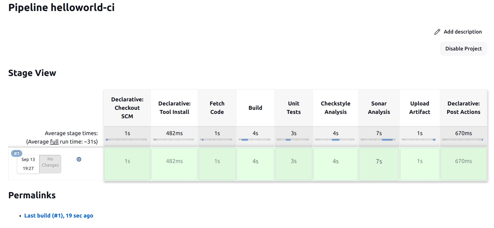
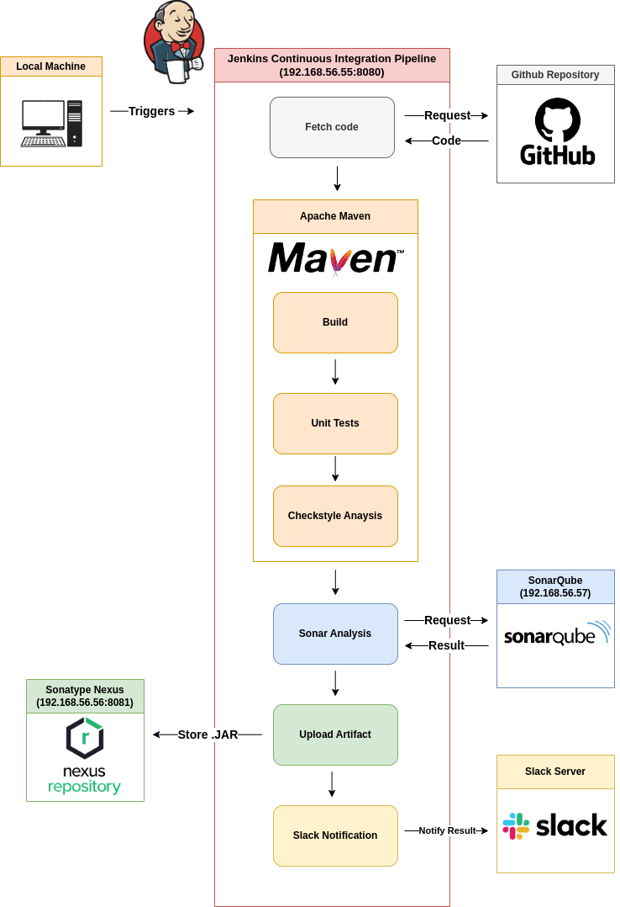

# Hello World Continuous Integration



### Project Introduction

A Java example of Continuous Integration using Jenkins Pipeline as Code (PaaC). The function of the code is simple, print "Hello World!" when executed. The primary focus of the project is on setting up a Continuous Integration pipeline for the repository.

## What is Continuous Integration (CI)?

Continuous Integration (CI) is a software development practice of automating common tasks such as build or test. It is used by different contributors on the same software project, allowing the team to merge code changes in an efficient and stable manner.

Key principles of Continuous Integration include:

- **Frequent Integration:** Developers integrate their code changes into a central repository multiple times a day.
- **Automated Testing:** Automated tests are run after each integration to identify bugs and issues.
- **Quick Feedback:** Developers receive rapid feedback on the quality of their code every time the code is built.
- **Maintainable Build Process:** Build and deployment processes are automated and version-controlled.

## Jenkins Pipeline as Code (PaaC)

[Jenkins](https://www.jenkins.io/) is a popular open-source server application for automating software development tasks such as building, testing, and deploying code changes.

**Pipeline as Code (PaaC)** is an approach to building the entire pipeline using a single file. The file defines the processes of build, test, and deployment. Allowing the pipeline easier to manage, share, and improve. Jenkins uses Groovy source syntax called Jenkinsfile. The pipeline can be built by placing Jenkinsfile in the Github repository and starting a Jenkins job by specifying the repository url.

## Architectural Overview



### Servers and Tools Used

#### Vagrant Hosted Servers in Virtual Machines:

1. **Jenkins Server (192.168.56.55:8080):** Jenkins serves as the central automation server for the CI pipeline, the server has jdk11 and Maven installed.
2. **Nexus Server (192.168.56.56:8081):** Nexus is used for storing and versioning artifacts, all the past build artifacts are stored here.
3. **SonarQube Server (192.168.56.57):** SonarQube is employed for code quality analysis, the analysis results can be viewed in both Jenkins and SonarQube servers.

#### Tools:

- **JDK Version 11:** Java Development Kit version 11 is utilized for building and running Java applications.
- **Apache Maven Version 3:** Maven version 3 manages the dependencies of the project, and communicates with Jenkins to build, test, package, and analyze the source code.
- **Slack:** Slack is used for notifying the results of the continuous integration after each build, facilitating team communication and collaboration.
- **GitHub Repository:** The GitHub repository has all of the Jenkinsfile and source codes in one place, it is referenced by Jenkins to fetch these codes.

### Setting Things Up

1. **Bring up the virtual machines**:
    * (a) Make sure [Vagrant](https://developer.hashicorp.com/vagrant/docs/installation) is installed on your local machine
    * (b) Locate to directory /server-config
    * (c) Run:
           ```
            vagrant up
          ```
2. **Jenkins server configuration**:
   * (a) Login to Jenkins and do the initial setups:
       
        [http://192.168.56.55:8080/](http://192.168.56.55:8080/)

   * (b) In Manage Jenkins >> Plugins, install following Jenkins plugins:

          Nexus Artifact Uploader
          Pipeline Maven Integration
          Pipeline Utility Steps
          Slack Notification Plugin
          SonarQube Scanner for Jenkins

   * (c) In Manage Jenkins >> Tools, set up the following tools:

        * JDK installation:
            - Name: java-11-openjdk-amd64
            - JAVA_HOME: /usr/lib/jvm/java-11-openjdk-amd64
         
        * Git installations:
            - Name: Default
            - Path to Git executable: git
          
        * SonarQube Scanner installations:
            - Name: SonarQube Scanner 4.7.0
            - Version: SonarQube Scanner 4.7.0.2747
          
        * Maven installations:
            - Name: MAVEN3
            - Install Automatically: ✅
            - Version: 3.9.4
              
   * (d) In Manage Jenkins >> System, configure the following items:

       * Jenkins Location:
         - Jenkins URL: http://192.168.56.55:8080/
            
       * SonarQube servers:
         - Environment variables: ✅
         - Name: sonarqube-server
         - Server URL: http://192.168.56.57/
         - Server authentication token: Add -> Jenkins -> kind: Secret Text -> *"go to the server, generate and paste a token here"*

        * Build Timestamp:
         - Enable BUILD_TIMESTAMP: ✅

        * Slack *(Change the team and channel name in Jenkinsfile too)*:
          - Workspace: *"your slack team name"*
          - Credential: Add -> Jenkins -> kind: Secret Text -> *"go to the server, generate and paste a token here"*
          - Default channel / member id: *"your slack channel name"*
         
   * (e) In Manage Jenkins >> Credentials, add credentials for Nexus:
       * Go go Credentials >> System >> Global Credentials
           - kind: Username with passwords: *"go to the server, generate and paste a token here"*
           - *("The initial setup for Nexus is necessary, go to the server, configure password, create repository 'helloworld-repo'")*
        
         
3. **Create Jenkins job**:
   * (a) Select "+ New Item":
       * Name: helloworld-ci
       * Pipeline: ✅
   * (b) Configuration >> Pipeline:
       * Definition: Pipleline script from SCM
       * SCM: git
       * Repository URL: https://github.com/cojuny/helloworld-ci

4. **BUILD with confidence**


